## Hitchhiker’s Guide to Super-Resolution: Introduction and Recent Advances

[▶ Original Report Link](https://ar5iv.labs.arxiv.org/html/2209.13131?_immersive_translate_auto_translate=1)

### 2 Setting and Terminology

#### 2.1 Problem Definition: Super-Resolution

Super-Resolution (SR) refers to methods that can **develop High-Resolution (HR) images** from **at least one Low-Resolution (LR) image**

##### 2.1.1 Single Image Super-Resolution (SISR)

Low-Resolution (LR) image 

$$x \in ℝ^{\bar{w} \times \bar{h} \times c}$$

High-Resolution (HR) image 

$$x \in ℝ^{w \times h \times c}$$

with $$\bar{w} \leq w$$ and $$\bar{h} \leq h$$

The amount of pixels of an image:

$$N_x = w \cdot h \cdot c$$

The set of all valid positions in 𝐱: 

$$\omega_x = \{(i,j,k) \in ℕ^3_1 \| i \leq h, j \leq w, k \leq c\}$$

A scaling factor:

$$s \in ℕ$$

It holds that $$h = s \cdot \bar{h}$$ and $$w = s \cdot \bar{w}$$

the inherent relationship between the two entities LR (𝐱) and HR (𝐲): 

$$𝒟: ℝ^{w \times h \times c} → ℝ^{\bar{w} \times \bar{h} \times c}$$  

$$x = 𝒟(𝐲;δ)$$ 

in which δ are parameters of 𝒟 that contain, for example, the scaling factor s and other elements like blur type.

#### 2.2 Evaluation: Image Quality Assessment (IQA)

##### 2.2.1 Mean Opinion Score (MOS)

**Human viewers** rate images with quality scores, typically 1 (bad) to 5 (good).

MOS is the arithmetic mean of all ratings. Despite **reliability**, mobilizing human resources is **time-consuming** and **cumbersome**, especially for large datasets.

##### 2.2.2 Peak Signal-to-Noise Ratio (PSNR)

It is the ratio between the maximum possible pixel-value L (255 for 8-bit representations) and the **Mean Squared Error (MSE)** of reference images. Given the approximation $\hat{𝐲}$ and the ground-truth 𝐲, PSNR is a logarithmic quantity using the decibel scale [dB]:

$$\mathrm{PSNR}\left(\mathbf{y},\widehat{\mathbf{y}}\right)=10\cdot\log_{10}\frac{L^2}{\frac{1}{N_{\mathbf{y}}}\sum_{p\in\Omega_{\mathbf{y}}}\left[\mathbf{y}_{p}-\widehat{\mathbf{y}}_{p}\right]^2}$$

It focuses on **pixel-level differences** instead of **mammalian visual perception**, which is more attracted to structures

It correlates **poorly with subjectively perceived quality**

##### 2.2.3 Structural Similarity Index (SSIM)

The Structural Similarity Index (SSIM) depends on three relatively independent entities: **luminance**, **contrast**, and **structures**

SSIM estimates for an image 𝐲 the **luminance** $$μ_𝐲$$ as the mean of the intensity, while it is estimating **contrast** $$σ_𝐲$$ as its standard deviation:

$$\mu_{\mathbf{y}}=\frac{1}{N_{\mathbf{y}}}\sum_{p\in\Omega_{\mathbf{y}}}\mathbf{y}_{p}$$  

$$\sigma_{\mathbf{y}}=\frac{1}{N_{\mathbf{y}}-1}\sum_{p\in\Omega_{\mathbf{y}}}\left[\mathbf{y}_{p}-\mu_{\mathbf{y}}\right]^{2}$$

A similarity comparison function S:

$$S
\begin{pmatrix}
x,y,c
\end{pmatrix}=\frac{2\cdot x\cdot y+c}{x^2+y^2+c},$$

where x and y are the compared scalar variables, and $$c = (k \cdot L)^2, 0 < k \ll 1$$ is a constant to avoid instability.

Given a ground-truth image 𝐲 and its approximation $$\hat{y}$$, the comparisons on luminance ($$𝒞_l$$) and contrast ($$𝒞_c$$) are

$$\mathcal{C}_l\left(\mathbf{y},\mathbf{\hat{y}}\right)=S\left(\mu_\mathbf{y},\mu_\mathbf{\hat{y}},c_1\right)\mathrm{~and~}\mathcal{C}_c\left(\mathbf{y},\mathbf{\hat{y}}\right)=S\left(\sigma_\mathbf{y},\sigma_\mathbf{\hat{y}},c_2\right)$$

where $$c_1, c_2 > 0$$. The empirical co-variance

$$\sigma_{\mathbf{y},\mathbf{\hat{y}}}=\frac{1}{N_{\mathbf{y}}-1}\sum_{p\in\Omega_{\mathbf{y}}}\left(\mathbf{y}_{p}-\mu_{\mathbf{y}}\right)\cdot\left(\mathbf{\hat{y}}_{p}-\mu_{\mathbf{\hat{y}}}\right),$$

determines the structure comparison ($$𝒞_s$$), expressed as the correlation coefficient between 𝐲 and $$\hat{y}$$:

$$\mathcal{C}_s\left(\mathbf{y},\widehat{\mathbf{y}}\right)=\frac{\sigma_{\mathbf{y},\hat{\mathbf{y}}}+c_3}{\sigma_{\mathbf{y}}\cdot\sigma_{\hat{\mathbf{y}}}+c_3},$$

where $$c_3 > 0$$. Finally, the SSIM is defined as:

$$\mathrm{SSIM}\left(\mathbf{y},\mathbf{\hat{y}}\right)=\left[\mathcal{C}_{l}\left(\mathbf{y},\mathbf{\hat{y}}\right)\right]^{a}\cdot\left[\mathcal{C}_{c}\left(\mathbf{y},\mathbf{\hat{y}}\right)\right]^{\beta}\cdot\left[\mathcal{C}_{s}\left(\mathbf{y},\mathbf{\hat{y}}\right)\right]^{\gamma}$$

where α>0,β>0 and γ>0 are adjustable control parameters for weighting relative importance of all components.

##### 2.2.4 Learning-based Perceptual Quality (LPQ)

In essence, LPQ tries to approximate a variety of **subjective ratings** by **applying DL methods**.

A significant drawback of LPQ is the limited **availability of annotated samples**.

##### 2.2.5 Task-based Evaluation (TBE)

One can focus on task-oriented features.

##### 2.2.6 Evaluation with defined Features

One example is the Gradient Magnitude Similarity Deviation (GMSD), which uses the pixel-wise Gradient Magnitude Similarity (GMS)

An alternative is the Feature Similarity (FSIM) Index. It also uses gradient magnitudes, but combines them with Phase Congruency (PC), a local structure measurement, as feature points.

##### 2.2.7 Multi-Scale Evaluation

In practice, SR models usually super-resolve to different scaling factors, known as Multi-Scaling (MS). Thus, evaluating metrics should address this scenario.

#### 2.3 Datasets and Challenges

Two of the most famous challenges are the New Trends in **Image Restoration** and **Enhancement (NTIRE) challenge**, and the Perceptual Image Restoration and Manipulation (PIRM) challenge.

#### 2.4 Color Spaces

Exploring other color spaces for DL-based SR methods is nearly nonexistent, which presents an exciting research gap.

### 3 Learning Objectives

#### 3.1 Regression-based Objectives

##### 3.1.1 Pixel Loss

The first one is **the Mean Absolute Error (MAE)**, or L​1-loss:

$$\mathcal{L}_{\mathrm{L1}}\left(\mathbf{y},\widehat{\mathbf{y}}\right)=\frac{1}{N_{\mathbf{y}}}\sum_{p\in\Omega_{\mathbf{y}}}\left|\mathbf{y}_{p}-\widehat{\mathbf{y}}_{p}\right|$$

It takes the absolute differences between every pixel of both images and returns the mean value.

The second well-known pixel loss function is the **Mean Squared Error (MSE)**, or L2-loss. It weights high-value differences higher than low-value differences due to an additional square operation:

$$\mathcal{L}_{\mathrm{L2}}\left(\mathbf{y},\mathbf{\hat{y}}\right)=\frac{1}{N_{\mathbf{y}}}\sum_{p\in\Omega_{\mathbf{y}}}\left|\mathbf{y}_{p}-\mathbf{\hat{y}}_{p}\right|^{2}$$

##### 3.1.2 Uncertainty-Driven Loss

An **adaptive weighted loss** for SISR, which aims at prioritizing texture and edge pixels that are visually more significant than pixels in smooth regions. Thus, the adaptive weighted loss treats every pixel unequally.

##### 3.1.3 Content Loss

Instead of using the difference between the approximated and the ground-truth image, one can transform both entities further into a more discriminant domain.

In more detail, the feature extractor is pre-trained on another task, i.e., image classification or segmentation. During the training of the actual SR model on the difference of feature maps, the parameters of the feature extractor remain fixed. Thus, the goal of the SR model is not to generate pixel-perfect estimations. Instead, it produces images whose features are close to the features of the target.

#### 3.2 Generative Adversarial Networks

The core idea is to use two distinct networks: a generator G and a discriminator D. The generator network learns to produce samples close to a given dataset and to fool the discriminator.

##### 3.2.1 Total Variation Loss

One way to regularize GANs is to use a Total Variation (TV) denoising technique known from image processing.

$$\mathrm{TV}(\mathbf{y})=\frac{1}{N_{\mathbf{y}}}\sum_{i,j,k}\sqrt{\underbrace{\left(\mathbf{y}_{i+1,j,k}-\mathbf{y}_{i,j,k}\right)^2+\underbrace{\left(\mathbf{y}_{i,j+1,k}-\mathbf{y}_{i,j,k}\right)^2}_{\text{diff. first axis}}}_{\text{diff. second axis}}}$$

##### 3.2.2 Texture Loss

Texture synthesis with parametric texture models has a long history with the goal of transferring global texture onto other images

#### 3.3 Denoising Diffusion Probabilistic Models

**Denoising Diffusion Probabilistic Models (DDPMs)** exploit this insight by formulating a Markov chain to alter one image into a noise distribution gradually, and the other way around.

### 4 Upsampling

#### 4.1 Interpolation-based Upsampling

Many DL-based SR models use image interpolation methods because of their simplicity. The most known methods are **nearest-neighbor**, **bilinear**, and **bicubic interpolation**.

#### 4.2 Learning-based Upsampling

##### 4.2.1 Transposed Convolution

Transposed convolution expands the spatial size of a given feature map and subsequently applies a convolution operation.

##### 4.2.2 Sub-Pixel Layer

Introduced with ESPCN, it uses a convolution layer to extract a deep feature map and rearranges it to return an upsampled output.

##### 4.2.3 Decomposed Upsampling

An extension to the above approaches is decomposed transposed convolution. Using 1D convolutions instead of 2D convolutions reduces the number of operations and parameters for the component $$k^2$$ to 2⋅k.

##### 4.2.4 Attention-based Upsampling

Another alternative to transposed convolution is attention-based upsampling [69]. It follows the definition of attention-based convolution (or scaled dot product attention) and replaces the 1x1 convolutions with upsampling methods.

##### 4.2.5 Upsampling with Look-Up Tables

Before generating the LUT, a small-scale SR model is trained to upscale small patches of a LR image to target HR patches. Subsequently, the LUT is created by saving the results of the trained SR model applied on a uniformly distributed input space. It reduces the upsampling runtime to the time necessary for memory access while achieving better quality than bicubic interpolation. On the other hand, it requires additional training to create the LUT.

##### 4.2.6 Flexible Upsampling

In order to overcome this limitation, a meta-upscale module was proposed [41]. It predicts a set of filters for each position in a feature map that is later applied to a location in a lower-resolution feature map. 

### 5 Attention Mechanisms for SR

#### 5.1 Channel-Attention

Feature maps generated by CNNs are not equally important. Therefore, essential channels should be weighted higher than counterpart channels, which is the goal of channel attention. It focuses on “which” (channels) carry crucial details.

#### 5.2 Spatial-Attention

In contrast to channel attention, spatial attention focuses on “where” the input feature maps carry important details, which requires extracting global information from the input.

#### 5.3 Mixed Attention

Since both attention types can be applied easily, merging them into one framework is natural. Thus, the model focuses on “which” (channel) is essential and “where” (spatially) to extract the most valuable features. This combines the benefits of both approaches and introduces an exciting field of research, especially in SR. One potential future direction would be to introduce attention mechanisms incorporating both concerns in one module.

### 6 Additional Learning Strategies

#### 6.1 Curriculum Learning

Curriculum learning follows the idea of training a model under easy conditions and gradually involving more complexity [84], i.e., additional scaling sizes.

#### 6.2 Enhanced Predictions

Instead of enhancing simple input-output pairs, one can use data augmentation techniques like rotation and flipping for final prediction.

#### 6.3 Learned Degradation

The Content Adaptive Resampler (CAR) introduced a resampler for downscaling. It predicts kernels to produce downscaled images according to its HR input. Next, a SR model takes the LR image and predicts the SR image. Thus, it simultaneously learns the degradation mapping and upsampling task.

#### 6.4 Network Fusion

Network fusion uses the output of all additional SR models and applies a fusion layer to the outputs. Finally, it predicts the SR image used for the learning objective.

#### 6.5 Multi-Task Learning

E.g., one can assign a label to each image and use multiple datasets for training. Next, a SR model can learn to reconstruct the SR image and predict its category (e.g., natural or manga image)

#### 6.6 Normalization Techniques

A slight change in the input distribution is a cause of many issues because layers need to continuously adapt to new distributions, which is known as covariate shift and can be alleviated with BatchNorm.

### 7 SR Models

### 8 Unsupervised Super-Resolution

#### 8.1 Weakly-Supervised

Weakly-supervised methods use unpaired LR and HR images

The first generator takes a LR image and super-resolves it. The output of the first generator constitutes a SR image

The second generator takes the prediction of the first generator and performs the inverse mapping. The result of the second generator is optimized via content loss with the original input, the LR image.

#### 8.2 Zero-Shot

Zero-shot or one-shot learning is associated with training on objects and testing on entirely different objects from a different class that was never observed.

#### 8.3 Deep Image Prior

It uses a CNN to predict the LR image when downsampled, given some random noise instead of an actual image. Therefore, it follows the strategy of ZSSR by using only the LR image. However, it fixes the input to random noise and applies a fixed downsampling method to the prediction.

### 9 Neural Architecture Search

[▶ Original Report Link](https://ar5iv.labs.arxiv.org/html/2205.07514?_immersive_translate_auto_translate=1)

## Residual Local Feature Network for Efficient Super-Resolution

### 2 Related Work

#### 2.1 Efficient Image Super-Resolution

SCRNN applied the deep learning algorithm to the SISR field for the first time. It has three layers and uses bicubic interpolation to upscale the image before the net, causing unnecessary computational cost.

To address this issue, FSRCNN employed the deconvolution layer as the upsampling layer and upscaled the image at the end of net. 

DRCN introduced a deep recursive convolutional network to reduce the number of parameters. 

LapSRN proposed the laplacian pyramid super-resolution block to reconstruct the sub-band residuals of HR images.

CARN proposed an efficient cascading residual network with group convolution, which obtains comparable results against computationally expensive models.

IMDN proposed a lightweight information multi-distillation network by constructing the cascaded information multi-distillation blocks, which extracts hierarchical features step-by-step with the information distillation mechanism (IDM).

RFDN refined the architecture of IMDN and proposed the residual feature distillation network, which replaced IDM with feature distillation connections.

ECBSR proposed an edge-oriented convolutional block based on the reparameterization technique[10], which can improve the learning ability of the model without increasing the inference time.

#### 2.2 Train Strategy for PSNR-oriented SISR

These SR networks are usually trained by the ADAM optimizer with standard l1 loss for hundreds of epoches. To improve the robustness of training, they usually adopt a smaller learning rate and patch size.

Recent works on image recognition[3] and optical flow estimation[41] have demonstrated that advanced training strategies can enable older network architectures to match or surpass the performance of novel architectures.

RFDN[31] demonstrated that both fine-tuning the network with l2 loss and initializing a 4x SR model with pretrained 2x model can effectively improve PSNR. 

RRCAN[30] revisited the popular RCAN model and demonstrated that increasing training iterations clearly improves the model performance.

### 3 Method

#### 3.1 Network Architecture



```mermaid
graph LR
  A[Input: Low-Resolution Image] --> B[Conv 3×3<br>Shallow Feature Extraction]
  B --> C1[RLFB Block 1]
  C1 --> C2[RLFB Block 2]
  C2 --> C3[RLFB Block 3]
  C3 --> D[Conv 3×3<br>Post RLFB]

  B -.-> E[Skip Connection]
  D --> F[Add: Long Residual]
  E --> F

  F --> G[Conv 3×3<br>Upsample Preparation]
  G --> H[PixelShuffle<br>Upsampling]
  H --> I[Output: High-Resolution Image]
```

#### 3.2 Revisiting the Contrastive Loss

 The contrastive loss is defined as:

#### 3.3 Warm-Start Strategy

For large scale factors like 3 or 4 in the SR task, some previous works use **the 2x model** as **a pre-trained network** instead of training them from scratch.

## Efficient Long-Range Attention Network for Image Super-resolution

[▶ Original Report Link](https://ar5iv.labs.arxiv.org/html/2203.06697?_immersive_translate_auto_translate=1)

### 2 Related work

#### 2.1 CNN-based SR methods

CNN-based methods have demonstrated impressive performance in the SR task. 

To build more effective models for SR, the recently developed methods tend to employ deeper and more complicated architectures as well as the attention techniques.

#### 2.2 Transformer-based SR methods

The breakthrough of transformer networks in natural language processing (NLP) inspired of use of self-attention (SA) in computer vision tasks. The SA mechanism in transformers can effectively model the dependency across data, and it has achieved impressive results on several high-level vision tasks, such as image classification, image detection, and segmentation. 

### 3 Methodology

#### 3.1 Overall Pipeline of ELAN


#### 3.2 Efficient Long-range Attention Block (ELAB)


## ShuffleMixer: An Efficient ConvNet for Image Super-Resolution  

[▶ Original Report Link](https://ar5iv.labs.arxiv.org/html/2205.15175?_immersive_translate_auto_translate=1)

### Proposed Method

We aim to develop an efficient large-kernel CNN model for the SISR task. To meet the efficiency goal, we introduce key designs to the feature mixing block employed to encode information efficiently.

#### 3.1 ShuffleMixer Architecture


## Omni Aggregation Networks for Lightweight SR

[▶ Original Report Link](https://ar5iv.labs.arxiv.org/html/2304.10244?_immersive_translate_auto_translate=1)

### 3 Methodology

#### 3.1 Attention Mechanisms in Super-Resolution

**Two** attention paradigms are widely adopted in SR to assist in analyzing and aggregating comprehensive patterns.

**Spatial Attention**. Spatial attention can be regarded as an anisotropic selection process. Spatial self-attention and spatial gate are predominantly applied.

**Channel Attention**. There are two categories of channel attention, i.e., scalar-based and covariance-based, proposed to perform channel recalibration or transmit patterns among channels.

#### 3.2 Omni Self-Attention Block

To mine all the correlations hidden in the latent variables, we propose a novel self-attention paradigm called Omni Self-Attention (OSA) block. Unlike existing self-attention paradigms (e.g., spatial self-attention [51, 5, 37]) that only indulge in unidimensional processing, OSA establishes the spatial and channel context simultaneously. 

The proposed OSA calculates the score matrices corresponding to the space and channel direction through sequential matrix operations and rotation

$$\begin{aligned}
 & Q^{s}=X\cdot W_{q},\quad K^{s}=X\cdot W_{k},\quad V^{s}=X\cdot W_{v}, \\
 & Y_{s}=\mathcal{A}^{s}(Q^{s},K^{s},V^{s})=\mathrm{SoftMax}(Q^{s}K^{sT})\cdot V^{s}, \\
 & Q^{c}=\mathcal{R}(Q^{^{\prime}}),K^{c}=\mathcal{R}(K^{^{\prime}}),V^{c}=\mathcal{R}(V^{^{\prime}}), \\
 & Y_{c}=\mathcal{A}^{c}(Q^{c},K^{c},V^{c})=\mathrm{SoftMax}(K^{c}Q^{cT})\cdot V^{c}, \\
 & Y_{OSA}=\mathcal{R}^{-1}\left(Y_{c}\right),
\end{aligned}$$

#### 3.3 Omni-Scale Aggregation Group

OSAG mainly consists of three stages: local, meso and global aggregations.


#### 3.4 Network Architecture

Omni-SR consists of three parts, i.e., **shallow feature extraction**, **deep feature extraction**, and **image reconstruction**.

**Omni-Scale Aggregation Group (OSAG).**

Each OSAG contains **a local convolution block (LCB)**, **a meso-OSA block**, **a global-OSA block**, and **an ESA block**

**Optimization Objective**

Following prior works, we train the model by minimizing a standard $$L_1$$ loss between model prediction $$\hat{I}_{H​R}$$ and HR label $$I_{H​R}$$ as follows:

$$\mathcal{L}=\|I_{HR}-\widehat{I}_{HR}\|_{1}.$$

## Equivalent Transformation and Dual Stream Network Construction for Mobile Image Super-Resolution

[▶ Original Report Link](https://openaccess.thecvf.com/content/CVPR2023/papers/Chao_Equivalent_Transformation_and_Dual_Stream_Network_Construction_for_Mobile_Image_CVPR_2023_paper.pdf)

## Pre-Trained Image Processing Transformer

### 3 Image Processing Transformer

#### 3.1 IPT architecture


#### 3.2 Pre-training on ImageNet

在 ImageNet 上对每张高分辨率图像，通过下采样（超分辨）、加噪（去噪）、合成雨滴（去雨）等多种操作，生成超过 1 000 万对“降质－原图”样本。

自监督对比学习：在标准的 L₁/L₂ 重建损失之外，加入 patch 级对比损失（contrastive loss），鼓励不同输入（如噪声/低分）下的相同位置 patch 在特征空间中靠近，从而提升任务间的可迁移性

### 4 Experiments

#### 4.1 Super-resolution

#### 4.2 Denoising

#### 4.3 Deraining

#### 4.4 Generalization Ability

训练结束后，只需针对某一任务替换对应的 head 和 tail，保持共享的 Transformer Body 固定或微调，即可在小规模且任务特定的数据集上快速收敛。

例如，×2/×3/×4 超分辨、不同噪声级别的去噪、不同雨强度的去雨等，都能通过同一预训练模型高效微调。

## SwinIR: Image Restoration Using Swin Transformer

### 3 Method

#### 3.1 Network Architecture

SwinIR consists of three modules: shallow feature extraction, deep feature extraction and high-quality (HQ) image reconstruction modules. 

1. Shallow Feature Extraction
  - 单层卷积，负责从输入图像中提取低频信息（直传给重建模块），保留原始细节
2. Deep Feature Extraction
  - 由 $$M$$ 个残差 Swin Transformer 块（Residual Swin Transformer Block, RSTB）堆叠而成。
  - 每个 RSTB 内部包含 $$L$$ 层 Swin Transformer Layer（STL），利用窗口自注意力（window-based self‑attention）和跨窗 shifted window 交互机制，有效建模局部与跨块依赖。
  - 块尾附加一层卷积以增强表征，并通过残差连接将输入特征直加至输出，实现特征聚合与梯度传递
3. High‑Quality Image Reconstruction
  - 对于超分任务，使用 Pixel Shuffle 或转置卷积进行上采样；对于去噪、去压缩伪影任务，则保持原分辨率输出
  - 最终再经一层卷积生成恢复图像，并与浅层特征相加补偿低频信息

## Transformer for Single Image Super-Resolution

### 3 Efficient Super-Resolution Transformer

Efficient Super-Resolution Transformer (ESRT) mainly consists of four parts: **shallow feature extraction**, **Lightweight CNN Backbone (LCB)**, **Lightweight Transformer Backbone (LTB)**, and **image reconstruction**.

#### 3.1 Lightweight CNN Backbone(LCB)

High Preservin Block(HPB)

in HPB, we creatively preserve the High-frequency Filtering Module (HFM) and Adaptive Residual Feature Block (ARFB).


#### 3.2 High-frequency Filtering Module(HFM)

The schematic diagram of the proposed HFM module.


##### 3.2.1 Adaptive Residual Feature Block(ARFB)

when the depth of the model grows, the residual architecture can mitigate the gradient vanishing problem and augment the representation capacity of the model.

ARFB contains two Residual Units (RUs) and two convolutional layers. To save memory and the number of parameters, RU is made up of two modules: Reduction and Expansion. 

The complete architecture of the proposed ARFB


#### 3.3 Light weight Transformer Backbone(LTB)

LTB is composed of specially designed Efficient Transformers (ETs), which can capture the long-term dependence of similar local regions in the image at a low computational cost.

##### 3.3.1 Pre- and Post-processing for ET

##### 3.3.2 Efficient Transformer (ET)


## A hybrid of transformer and CNN for efficient single image super-resolution via multi-level distillation

### 3 Methodology

#### 3.1 Network architecture

our proposed network consists of three parts: 1) shallow feature extraction module, 2) deep feature distillation module, and 3) high-resolution reconstruction module.


##### 3.1.1 Shallow feature extraction

##### 3.1.2 Deep feature distillation

The deep feature distillation module is our model’s main part, consisting of a stack of Transformer-CNN feature distillation blocks (TCFDB). Besides, we made a few changes to the feed-forward network (i.e., MLP) of the Swin Transformer and built the enhanced swin transformer layer (ESTL). The TCFDB consists of ESTLs and convolutional layers. Each TCFDB has two paths in which features are propagated. One path is for feature distillation operation, and the other is for gradual feature refinement operation. The two outputs are then concatenated using a 1 × 1 convolutional layer.

##### 3.1.3 Super-resolution reconstruction module

#### 3.2 Transformer-CNN feature distillation block

The proposed feature distillation block (TCFDB) consists of hybrid networks of CNN and enhanced Swin Transformer layer (ESTL), convolutional layers, and enhanced spatial attention


##### 3.2.1 Feature distillation and refinement pipeline

The TCFDB contains two pipelines, i.e., the feature distillation and refinement pipeline. The intermediate features are fed into the two pipelines parallelly. The 1 × 1 convolutional layers on the left are responsible for distilling features and reducing channels with few parameters. On the right are cascaded ESTLs, which can attend to spatial context and gradually refine features to attain more discriminate information. 

##### 3.2.2 Enhanced Swin Transformer layer (ESTL)

###### 3.2.2.1 The standard transformer layer

###### 3.2.2.2 Swin transformer layer

###### 3.2.2.3 Tensor reshape operation

###### 3.2.2.4 Convolutional feed-forward network (CFF)

##### 3.2.3 Enhanced spatial attention block (ESA)


#### 3.3 Image reconstruction module

#### 3.4 Loss function

##### 3.4.1 L1 pixel loss

##### 3.4.2 Contrastive loss

## Swin2SR: SwinV2 Transformer for Compressed Image Super-Resolution and Restoration

### 3 Our Method


The SwinV2 architecture modifies the shifted window self-attention module to better scale model capacity and window resolution.

The use of post normalization instead of pre normalization reduce the average feature variance of deeper layers and increase numerical stability during training.

#### 3.1 Experimental Setup

We evaluate our model on three tasks: JPEG compression artifacts removal (Section 4.1), classical and lightweight image super-resolution (Section 4.2) and compressed image super-resolution (Section 4.4).

Our model Swin2SR has the following elements, similar to SwinIR [33]: shallow feature extraction, deep feature extraction and high-quality image reconstruction modules.

The shallow feature extraction module uses a convolution layer to extract features, which are directly transmitted to the reconstruction module to preserve low-frequency information [64, 33].

The Deep feature extraction module is mainly composed of Residual SwinV2 Transformer blocks (RSTB), each of which utilizes several SwinV2 Transformer [36] layers (S2TL) for local attention and cross-window interaction.

Finally, both shallow and deep features are fused in the reconstruction module for high-quality image reconstruction. To upscale the image, we use standard a pixel shuffle operation.

The hyper-parameters of the architecture are as follows: the RSTB number, S2TL number, window size, channel number and attention head number are generally set to 6, 6, 8, 180 and 6, respectively.

#### 3.2 Implementation detail


## Efficient Long-Range Attention Network for Image Super-resolution

### 3 Methodology

#### 3.1 Overall Pipeline of ELAN

The overall pipeline of ELAN is shown in Figure 1(a), which consists of three modules: **shallow feature extraction**, **ELAB based deep feature extraction**, and **HR image reconstruction**.


#### 3.2 Efficient Long-range Attention Block


## SwinFIR: Revisiting the SwinIR with Fast Fourier Convolution and Improved Training for Image Super-Resolution

### 3 Methodology

#### 3.1 Model Design

SwinFIR consists of three modules: shallow feature extraction, deep feature extraction and high-quality (HQ) image reconstruction modules. The shallow feature extraction and high-quality (HQ) image reconstruction modules adopt the same configuration as SwinIR. The residual Swin Transformer block (RSTB) is a residual block with Swin Transformer layers (STL) and convolutional layers in SwinIR. They all have local receptive fields and cannot extract the global information of the input image. The Fast Fourier Convolution has the ability to extract global features, so we replace the convolution (3×3) with Fast Fourier Convolution and a residual module to fuse global and local features, named Spatial Frequency Block (SFB), to improve the representation ability of model. The analysis of Frequency Block (FB), Spatial-Frequency Transformer Layer (SFTL) and Hybrid Swin Transformer Layer (HSTL) are in Figure 4 and sec. 4.4.1.


#### 3.3 Data Augmentation

#### 3.4 Feature Ensemble

## NL-FFC: Non-Local Fast Fourier Convolution

### 3 Methodology

#### 3.1 Non-Local Fast Fourier Convolution


#### 3.2 Non-Local Attention Model


## HAT: Hybrid Attention Transformer for Image Restoration

### 4 Methodology

#### 4.1 Network Structure of HAT

HAT consists of three parts, including shallow feature extraction, deep feature extraction and image reconstruction.

#### 4.2 Hybrid Attention Block

Since many works have shown that convolution can help Transformer get better visual representation or achieve easier optimization [46, 63, 51, 52, 79], we incorporate a channel attention-based convolution block, i.e., the channel attention block (CAB) in Fig. 5(f), into the standard Transformer block to build our HAB.


#### 4.3 Overlapping Cross-Attention Block (OCAB)

We introduce OCAB to directly establish cross-window connections and enhance the representative ability for the window self-attention. Our OCAB consists of an overlapping cross-attention (OCA) layer and an MLP layer similar to the standard Swin Transformer block [16]. 

## HIPA: Hierarchical Patch Transformer for Single Image Super Resolution

### 3 Methodology

#### 3.1 Issues and Motivations


#### 3.2 Hierarchical Patch Transformer

#### 3.3 Attention-based Position Encoding


#### 3.4 Multi-Receptive Field Attention Group


## SRFormer: Permuted Self-Attention for Single Image Super-Resolution

### 3 Method

#### 3.1 Overall Architecture


#### 3.2 Permuted Self-Attention Block


#### 3.3 Large-WindowSelf-AttentionVariants

Token Reduction

Token Sampling

## Feature Modulation Transformer: Cross-Refinement of Global Representation via High-Frequency Prior for Image Super-Resolution

### 4 Proposed Method

#### 4.1 Model Overview


#### 4.2 High-frequency Enhancement Residual Block

#### 4.3 Shift Rectangle Window Attention Block

#### 4.4 Hybrid Fusion Block

## Table of Reports

Related Search tag in `Google Scholar`:

```
"image super-resolution" AND ("lightweight" OR "efficient") AND ("dynamic" OR "adaptive") after:2021
```

| **Title** (with Year)                                                                                        | **Tags**                                                   | **Summary**                                                                                                                                                                                                                                                                                                                                                                                                                                                                                          |
| ------------------------------------------------------------------------------------------------------------ | ---------------------------------------------------------- | ---------------------------------------------------------------------------------------------------------------------------------------------------------------------------------------------------------------------------------------------------------------------------------------------------------------------------------------------------------------------------------------------------------------------------------------------------------------------------------------------------- |
| **Lightweight Image Super-Resolution with Adaptive Weighted Learning Network(IMDN) (2019)**                  | *Lightweight, Information Distillation, Channel Attention* | IMDN introduces an Information Multi-distillation Network that employs a series of distillation blocks to extract and fuse hierarchical features efficiently. The network utilizes contrast-aware channel attention mechanisms to enhance feature representation, achieving a balance between performance and computational efficiency.                                                                                                                                                              |
| **Exploring Sparsity in Image Super-Resolution for Efficient Inference (SMSR) (2021)**                       | *Sparse Mask, Dynamic Inference, Efficient*                | SMSR introduces a Sparse Mask Super-Resolution network that learns spatial and channel-wise masks to identify and skip redundant computations during inference. While it enhances efficiency by pruning unnecessary operations, the binary nature of the masks limits fine-grained enhancements in complex regions.                                                                                                                                                                                  |
| **Dynamic Residual Self-Attention Network for Lightweight Single Image Super-Resolution (DRSAN) (2021)**     | *Dynamic, Self-Attention, Lightweight*                     | DRSAN proposes a dynamic residual self-attention mechanism that adaptively adjusts residual connections based on input content. This approach allows the network to modulate feature strength dynamically; however, the overall network structure remains static, lacking dynamic routing capabilities for different content complexities.                                                                                                                                                           |
| **Hitchhiker’s Guide to Super-Resolution: Introduction and Recent Advances (2023)**                          | *Survey, Overview*                                         | Comprehensive survey of deep learning-based SR, covering recent advancements like transformer-based models and diffusion approaches, and discussing remaining challenges (e.g., flexible upsampling, new loss functions, better metrics)..                                                                                                                                                                                                                                                           |
| **Residual Local Feature Network for Efficient SR (RLFN) (2022)**                                            | *Lightweight, Efficient*                                   | Proposes a compact network using only three conv layers for local feature learning, simplifying feature aggregation for a better speed–quality trade-off. With an improved contrastive loss and multi-stage warm-start training, RLFN outperforms prior efficient models in runtime while maintaining high PSNR/SSIM.                                                                                                                                                                                |
| **Efficient Long-Range Attention Network (ELAN) (2022)**                                                     | *Efficient, Attention, Transformer*                        | Introduces an efficient transformer-inspired SR model that reduces self-attention cost. Uses shift convolution to extract local structure and a group-wise multi-scale self-attention (GMSA) module to capture long-range dependencies. An efficient long-range attention block (ELAB), built by combining shift-conv and GMSA with shared attention, achieves transformer-level accuracy with significantly fewer parameters.                                                                       |
| **ShuffleMixer: An Efficient ConvNet for SR (2022)**                                                         | *Lightweight, Efficient, ConvNet*                          | Proposes a lightweight SR network with large depth-wise convolutions and channel split-shuffle operations to efficiently enlarge the receptive field. Augments large kernels with fused MobileNet-like convolution blocks to preserve fine details. Experimental results show ShuffleMixer is \~3× smaller (in FLOPs and params) than previous efficient models (e.g., CARN) while achieving competitive performance.                                                                                |
| **Omni-SR: Omni Aggregation Networks for Lightweight SR (2023)**                                             | *Lightweight, Transformer, Multi-scale*                    | Transformer-based framework targeting <1M parameters. Introduces an **Omni Self-Attention (OSA)** block that densely connects spatial and channel attention, simultaneously modeling correlations across spatial and channel dimensions. Also proposes a multi-scale interaction scheme to expand the effective receptive field in shallow models. Omni-SR achieved record-high performance for lightweight SR                                                                                       |
| **ETDS: Equivalent Transformation & Dual-Stream Network for Mobile SR (2023)**                               | *Mobile, Dual-Branch, Efficient*                           | Targets real-time SR on mobile devices. Proposes an **Equivalent Transformation (ET)** technique to convert heavy layers into mobile-friendly ops (reparameterizing into standard conv+ReLU). Builds a dual-stream network to mitigate the extra parameters from ET and enhance feature extraction.                                                                                                                                                                                                  |
| **Pre-TrainedImageProcessingTransformer (2021)**                                                             | *Transformer、Pre-training、Multi-task*                    | The first model to apply Transformer to super-resolution. Use ViT architecture and multi-task pre-training on large-scale ImageNet data, and then fine-tune for SR  IPT has up to 115M parameters, but with the support of pre-training, its performance is better than previous CNN methods, achieving the most advanced PSNR/SSIM at the time                                                                                                                                                      |
| **SwinIR: Image Restoration Using Swin Transformer （2021）**                                                | *Transformer、Local Attention、Hierarchical*               | An efficient image restoration model based on Swin Transformer. Using window self-attention and hierarchical structure, it surpasses the performance of IPT without large-scale pre-training.                                                                                                                                                                                                                                                                                                        |
| **ESRT: Efficient Super-Resolution Transformer (CVPRW 2022)**                                                | *Hybrid、Lightweight、Transformer+CNN*                     | A lightweight model with a CNN+Transformer hybrid architecture. It uses a lightweight CNN backbone to dynamically adjust the feature map size to reduce computation, and combines a series of efficient Transformer modules (EMHA attention) to extract long-range dependencies. ESRT significantly reduces video memory usage while maintaining competitive performance (4 times less video memory than the original ViT model)                                                                     |
| **A hybrid of transformer and CNN for efficient single image super-resolution via multi-level distillation** | *Hybrid、CNN+Transformer、Distillation*                    | A hybrid network constructed by cascading Transformer-CNN feature distillation blocks. Each block combines the global modeling capabilities of Transformer and the local fine representation of CNN, distilling and strengthening features step by step. This design not only exploits global dependencies but also retains local details, achieving reconstruction accuracy comparable to large models with lower computational effort.                                                             |
| **Swin2SR: SwinV2 Transformer for Compressed SR (ECCV 2022)**                                                | *Transformer、Enhanced、Real-World SISR*                   | Improved SwinIR based on Swin Transformer V2 for compressed image super-resolution. Swin2SR solves the problems of Transformer deep training instability and large data requirements through more stable training and handling of pre-training/fine-tuning resolution differences.                                                                                                                                                                                                                   |
| **ELAN: Efficient Long-Range Attention Network (ECCV 2022)**                                                 | *Transformer、Efficient、Multi-Scale*                      | Proposes an efficient long-range attention block (ELAB), extracts local features through shifted convolution, and then calculates self-attention on grouped multi-scale windows to capture global dependencies. The grouping and shifting strategies are used to reduce the attention calculation overhead.                                                                                                                                                                                          |
| **SwinFIR: SwinIR with Fast Fourier Convolution (2022)**                                                     | *Transformer、Frequency、Hybrid*                           | Fast Fourier convolution (FFC) units are introduced in SwinIR to expand the receptive field. By processing global information in the frequency domain, SwinFIR can supplement the locality of window attention and improve the reconstruction of global structure and high-frequency details. With the improved training strategy, SwinFIR achieves additional performance gains over the original SwinIR.                                                                                           |
| **NL-FFC: Non-Local Fast Fourier Convolution (CVPRW 2022)**                                                  | *Attention、Fourier、Hybrid*                               | A super-resolution network that fuses non-local attention with fast Fourier convolution. The model first obtains global correlation through non-local attention, and then uses FFT convolution to extract global frequency features and fuse them with local features. This local + global feature fusion method expands the network receptive field, reduces the limitation of spatial convolution, and accelerates low-frequency convergence.                                                      |
| **HAT: Hybrid Attention Transformer for Image Restoration**                                                  | *Transformer、Hybrid Attention、SOTA*                      | A hybrid Transformer model that combines channel attention and window self-attention. HAT further explores the potential of Transformer based on SwinIR, and "activates" more pixels to participate in reconstruction through cascaded hybrid attention modules. Its ultra-deep structure achieved new SOTA results on classic datasets and was one of the models with the highest super-resolution PSNR at the time.                                                                                |
| **HIPA: Hierarchical Patch Transformer (TIP 2023)**                                                          | *Transformer、Hierarchical、Adaptive Patches*              | The Transformer architecture with layered variable-size patches is introduced. The model gradually restores the image in multiple stages: the initial stage uses small patches to fine-grainedly process high-texture areas, and the subsequent stages gradually merge them into larger patches to process smooth areas. At the same time, a learnable position encoding based on attention is proposed to dynamically emphasize important tokens.                                                   |
| **SRFormer: Permuted Self-Attention for SISR (ICCV 2023)**                                                   | *Transformer、Large-Window、Efficient*                     | The permuted self-attention (PSA) mechanism is proposed to support self-attention calculations for larger windows. By compressing the KV channel dimension and exchanging spatial information to the channel, SRFormer can still run at low cost when the window size is expanded to 24×24. FFN is also improved (introducing deep convolution) to enhance local modeling. Experiments show that SRFormer achieves higher PSNR than SwinIR and ELAN with less computation on ×2–×4 super-resolution. |
| **CRAFT: Cross-Refinement Feature Transformer (ICCV 2023)**                                                  | *Hybrid、Transformer+CNN、High-Frequency*                  | It is found that pure Transformer focuses on low-frequency reconstruction and is not enough to recover high-frequency details. Therefore, CRAFT adopts a two-branch hybrid architecture: CNN-type high-frequency enhanced residual block (HFERB) extracts local details, and Transformer-type shifted rectangular window attention block (SRWAB) captures global information. The fusion module then injects high-frequency priors into the global representation.                                   |
| **SAFMN: Spatially-Adaptive Feature Modulation for Efficient SR (2023)**                                     |                                                            |                                                                                                                                                                                                                                                                                                                                                                                                                                                                                                      |
| **DLGSANet: Dynamic Local/Global Self-Attention Network (2023)**                                             |                                                            |                                                                                                                                                                                                                                                                                                                                                                                                                                                                                                      |
| **AsConvSR: Fast SR Network with Assembled Convolutions (2023)**                                             |                                                            |                                                                                                                                                                                                                                                                                                                                                                                                                                                                                                      |
| **WBSR: Weight-Balancing for Efficient SR (2024)**                                                           |                                                            |                                                                                                                                                                                                                                                                                                                                                                                                                                                                                                      |
| **PCSR: Pixel-Level Classification for SR (2024)**                                                           |                                                            |                                                                                                                                                                                                                                                                                                                                                                                                                                                                                                      |
| **LAMNet: Linear Adaptive Mixer Network for SR (2023)**                                                      |                                                            |                                                                                                                                                                                                                                                                                                                                                                                                                                                                                                      |
| **FIWHN: Feature Interaction Weighted Hybrid Network (2024)**                                                |                                                            |                                                                                                                                                                                                                                                                                                                                                                                                                                                                                                      |
| **TCSR: Transformer-CNN for Lightweight SR (2023)**                                                          |                                                            |                                                                                                                                                                                                                                                                                                                                                                                                                                                                                                      |
| **HFFN: High-Frequency Focused Network (2023)**                                                              |                                                            |                                                                                                                                                                                                                                                                                                                                                                                                                                                                                                      |
| **RAMiT: Reciprocal Attention Mixing Transformer (2023)**                                                    |                                                            |                                                                                                                                                                                                                                                                                                                                                                                                                                                                                                      |
| **SCNet: Fully 1×1 Convolutional SR Network (2023)**                                                         |                                                            |                                                                                                                                                                                                                                                                                                                                                                                                                                                                                                      |
| **QSRNet: Quick SR Network for Mobile (2023)**                                                               |                                                            |                                                                                                                                                                                                                                                                                                                                                                                                                                                                                                      |
| **DITN: Deployment-Friendly Transformer for SR (2023)**                                                      |                                                            |                                                                                                                                                                                                                                                                                                                                                                                                                                                                                                      |
| **Dynamic Graph SR via Message Passing & Conv Mixer (2025)**                                                 |                                                            |                                                                                                                                                                                                                                                                                                                                                                                                                                                                                                      |
| **BSRN: Blueprint Separable Residual Network (2022)**                                                        |                                                            |                                                                                                                                                                                                                                                                                                                                                                                                                                                                                                      |
| **ECBSR: Edge-Oriented Convolution Block for Real-Time SR (2022)**                                           |                                                            |                                                                                                                                                                                                                                                                                                                                                                                                                                                                                                      |
| **ARM: Any-Time Super-Resolution Method (2022)**                                                             |                                                            |                                                                                                                                                                                                                                                                                                                                                                                                                                                                                                      |
| **ADSRNet: Adaptive Heterogeneous CNN for SR (2024)**                                                        |                                                            |                                                                                                                                                                                                                                                                                                                                                                                                                                                                                                      |
| **LDEN: Learnable Detail Enhancement Network (2025)**                                                        |                                                            |                                                                                                                                                                                                                                                                                                                                                                                                                                                                                                      |
| **Swin2SR: SwinV2 Transformer for Compressed SR (2023)**                                                     |                                                            |                                                                                                                                                                                                                                                                                                                                                                                                                                                                                                      |
| **ESRT: Efficient SR Transformer (2022)**                                                                    |                                                            |                                                                                                                                                                                                                                                                                                                                                                                                                                                                                                      |
|                                                                                                              |                                                            |                                                                                                                                                                                                                                                                                                                                                                                                                                                                                                      |

## Possible Architecture

```shell
py -3.11 train2.py --train_dir Data/DIV2K_train_HR --val_dir Data/DIV2K_valid_HR --scale 2 --epochs 100 --batch_size 16 --patch_size 128
```

### Overall Architecture

```mermaid
flowchart TD
    A[Input LR Image] --> B[Conv 3×3, 3→C channels<br/>+ ReLU]
    B --> C[Shallow Features F₀]
    C --> D1[RDB Block 1]
    D1 --> D2[RDB Block 2]
    D2 --> D3[…]
    D3 --> Dn[RDB Block N]
    Dn --> E[Concat all block outputs]
    E --> F[Conv 1×1 Fusion → C channels]
    F --> G[ESA: Spatial Attention]
    G --> H[Add skip connection<br/>F + F₀]
    H --> I[Conv 3×3 → 3×scale² channels]
    I --> J[PixelShuffle ×scale]
    J --> K[Output HR Image]
```


### Residual Distillation Block


